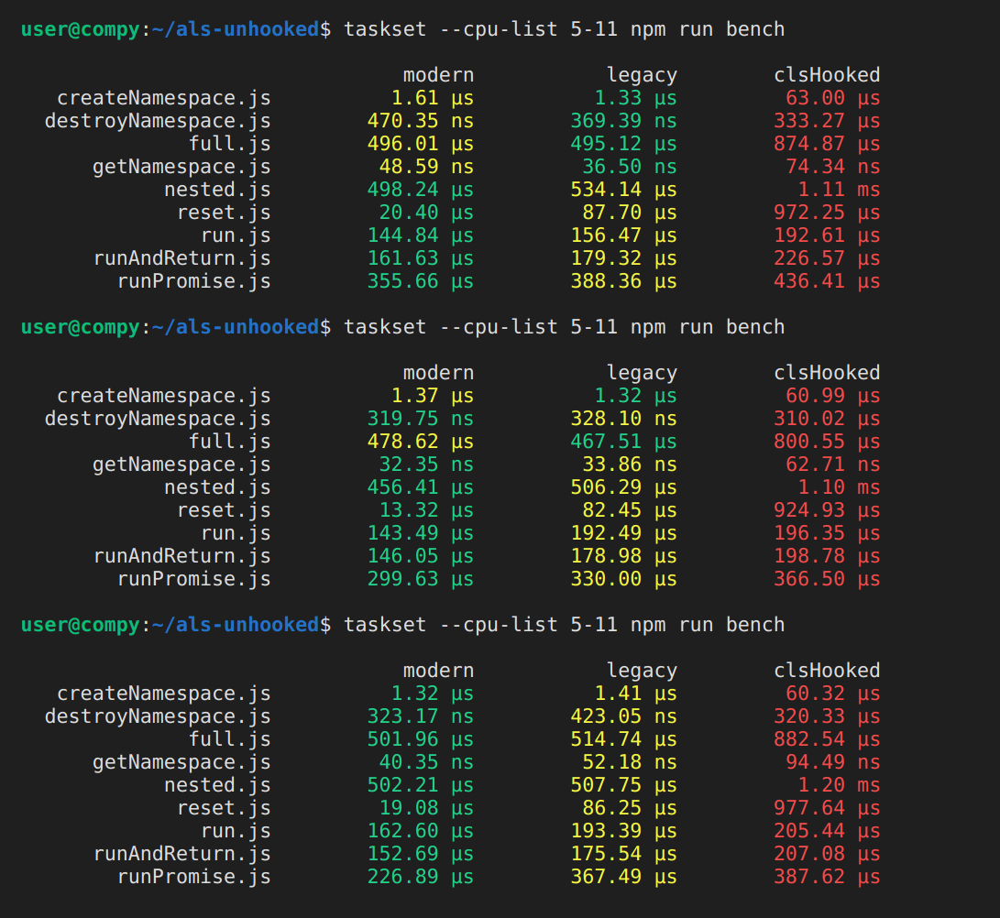

<!-- markdownlint-disable blanks-around-fences no-blanks-blockquote -->

# Asynchronous Local Storage ( UN-Hooked )

**This is a fork of [cls-hooked] using [AsyncLocalStorage] instead of [async_hooks].**

Asynchronous context tracking has matured. [AsyncLocalStorage], the stable [async_hooks] implementation, brings significant optimizations, and AsyncContextFrame (v22+, enabled by default in v24+) lets us drop async_hooks entirely. This package is a drop-in [cls-hooked] replacement built on AsyncLocalStorage to keep pace with ongoing Node.js improvements.

## Contents

- [Documentation](#documentation)
- [Usage](#usage)
  - [Use with Sequelize v6](#use-with-sequelize-v6)
  - [Overriding Sub-dependencies](#overriding-sub-dependencies)
- [Modern vs Legacy](#modern-vs-legacy)
- [Performance](#performance)
- [Working with EventEmitters](#working-with-eventemitters)
- [Acknowledgments](#acknowledgments)
- [License](#license)

## Documentation

[API Docs](https://zxanderh.github.io/als-unhooked/)

## Usage

One common use case is tracking a user for the duration of an http request. Suppose you use a middleware to authenticate your users:

```javascript
// app.js
import express from 'express'
import als from 'als-unhooked/legacy';

const app = express();
const namespace = als.createNamespace('user_session');

// enter the namespace context
app.use((req, res, next) => {
  namespace.run(() => {
    next();
  });
});

// auth middleware
app.use(async (req, res, next) => {
  const user = await db.getUserFromReq(req);
  namespace.set('user', user);
  next();
});
```

Later on in the request lifecycle, you need to attribute the creation of some record to that user:

```javascript
// thing.module.js

import als from 'als-unhooked/legacy';
import db from './lib/db.js';

const namespace = als.getNamespace('user_session');

async function createThing(_thing) {
  _thing.createdBy = namespace.get('user').id;
  await db.thing.create(_thing);
}
```

### Use with Sequelize v6

Built to work with [sequelize v6][v6], which uses [cls-hooked] for [automatic transaction passing][autotxn]:

```javascript
// app.js

import { Sequelize } from 'sequelize';
import ALS from 'als-unhooked/modern';

Sequelize.useCLS(new ALS());
```

The Legacy API works with sequelize too, but Modern is faster.

### Overriding Sub-dependencies

If you don't use cls-hooked directly, but one of your (sub-)dependencies does, you can add an override. The syntax differs slightly depending on your package manager.

For [npm] and [bun]:
```jsonc
// package.json
{
  // ...
  "overrides": {
    "cls-hooked": "npm:als-unhooked"
  }
}
```

For [yarn]:
```jsonc
// package.json
{
  // ...
  "resolutions": {
    "cls-hooked": "npm:als-unhooked"
  }
}
```

For [pnpm]:
```yaml
// pnpm-workspace.yaml
overrides:
  "cls-hooked": "npm:als-unhooked"
```

## Modern vs Legacy

> **TL;DR** If you're using [sequelize v6][v6] or just want a nice AsyncLocalStorage implementation,
> use the modern API. If you need a drop-in replacement for cls-hooked for use with something
> other than sequelize, you probably want the Legacy API.

The package has 2 different APIs: modern and legacy. The legacy API is a total drop-in replacement
for [cls-hooked]. In accomplishing this, it creates overhead that, while minimal, can be avoided
for many applications. It also inherits some mostly-outdated design patterns, such as process-level
global variables. To eliminate these, a minimal wrapper of AsyncLocalStorage was created to be:

1. Easy to use
2. Compatible with sequelize

## Performance

JS benchmarks should always be taken with a grain of salt. That said, the following results should hopefully show that both the the Modern API and Legacy API of als-unhooked are more performant than [cls-hooked]. Further, the Modern API is generally more performant than the Legacy API.



> Note: Only the average run times are shown. See [benchmark/_exec.js](./benchmark/_exec.js) for more details on how the benchmarks are run.

> Note 2: The Modern API was retrofitted with some functionality from the legacy interface for testing parity.

## Working with EventEmitters

Listeners triggered by event-driven classes like EventEmitter will sometimes be called in a different execution context, resulting in so-called "context loss." To mitigate this, [cls-hooked] provides the [Namespace#bindEmitter] method, which uses [emitter-listener] to monkeypatch the EventEmitter, automatically binding every listener to the current Namespace context. This method is convenient, and may even be necessary in some cases. In most cases, however, avoiding context loss is as simple is binding the listener before adding it to the emitter:

```javascript
namespace.run(() => {
                            // ⬇️ bound. Retains current context
  eventEmitter.on('my_event', namespace.bind(() => {
    namespace.get('color'); // === 'red'
  }));
                            // ⬇️ NOT bound. Receives context in which emit() is called.
  eventEmitter.on('my_event', () => {
    namespace.get('color'); // === 'blue'
  });

  // set value for bound handler
  namespace.set('color', 'red');

  // enter new context
  namespace.run(() => {
    // set value for unbound handler
    namespace.set('color', 'blue');

    // emit
    eventEmitter.emit('my_event');
  });
});
```

If you do need to use [Namespace#bindEmitter], be sure to install [emitter-listener], as it is not installed alongside als-unhooked by default.

## Acknowledgments

Thanks to [@jeff-lewis](https://github.com/jeff-lewis) for [cls-hooked], and to the many others who have contributed to async context tracking in node over the years.

## License

See [LICENSE](https://github.com/zxanderh/als-unhooked/blob/main/LICENSE)
for the details of the BSD 2-clause "simplified" license used by `als-unhooked`.

[v6]: https://github.com/sequelize/sequelize/tree/v6
[AsyncLocalStorage]: https://nodejs.org/api/async_context.html#class-asynclocalstorage
[async_hooks]: https://github.com/nodejs/node/blob/master/doc/api/async_hooks.md
[autotxn]: https://sequelize.org/docs/v6/other-topics/transactions/#automatically-pass-transactions-to-all-queries
[cls-hooked]: https://github.com/jeff-lewis/cls-hooked
[emitter-listener]: https://github.com/othiym23/emitter-listener
[Namespace#bindEmitter]: https://zxanderh.github.io/als-unhooked/legacy/Namespace.html#bindemitter
[bun]: https://bun.sh/docs/install/overrides#overrides
[yarn]: https://yarnpkg.com/configuration/manifest/#resolutions
[npm]: https://docs.npmjs.com/cli/v9/configuring-npm/package-json#overrides
[pnpm]: https://pnpm.io/10.x/settings#overrides
